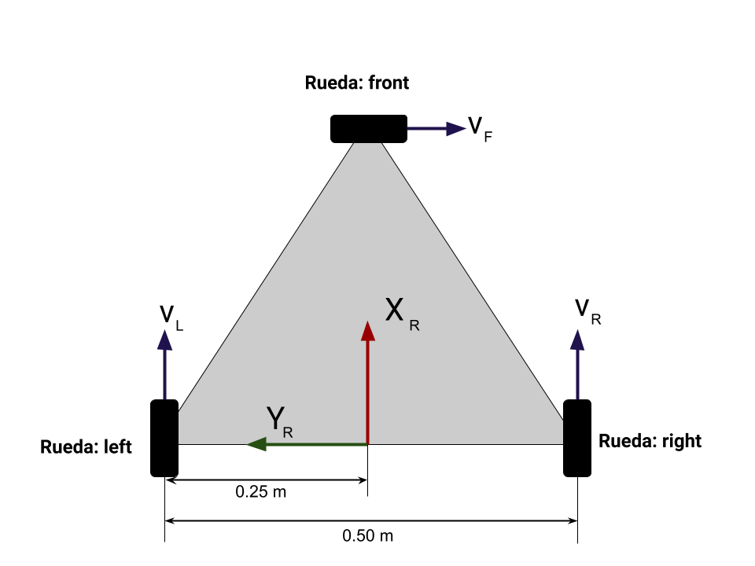
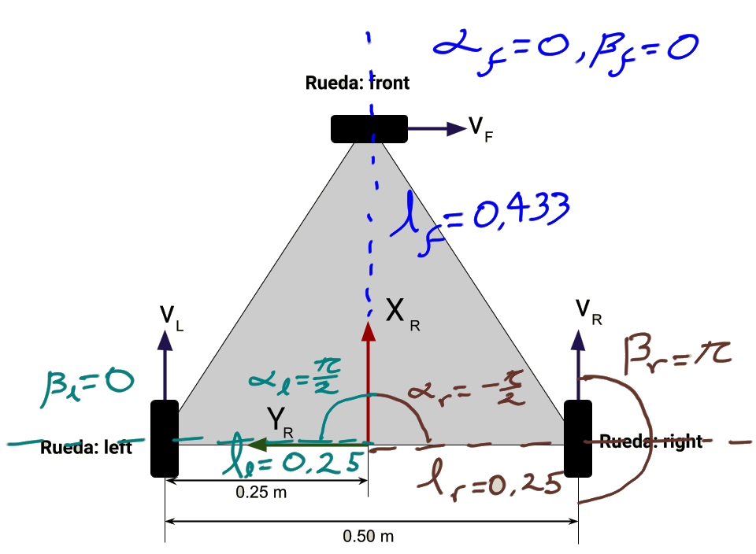

# Modelos de robots para prueba de modelo cinematico

En este paquete se encuentra de forma condensada la solución del robot 1 propuesto por Jose Fajardo que se encuentra en el repositorio : https://github.com/jmfajardod/robots_rycsv_description y en el repositorio: https://github.com/jmfajardod/models_robots_rycsv_py .

## Comandos para replicar resultados
Primero hay con usar el comando catkin build con el paquete:
> <code> catkin build robot_1_solution  </code>

Luego realizar source del catkin
> <code> source ~/catkin_ws/devel/setup.bash </code>

Posterior se sugiere usar el archivo launch robot_test_simulation.launch y así visualizar el robot tanto en Rviz como en Gazebo:

> <code> roslaunch robot_1_solution robot_test_simulation.launch </code>

Y por ultimo se ejecutara el nodo que nos permite crear el topico > <code>/cmd_vel</code> el robot:
> <code> rosrun robot_1_solution node_1.py  </code>

Para verificar que el proceso haya funcionado bien de debe verificar que los topicos activos sean los siguientes:
> <code> /clicked_point </code>
> <code> /clock </code>
> <code> /cmd_vel </code>
> <code> /front_wheel_ctrl/command </code>
> <code> /gazebo/link_states </code>
> <code> /gazebo/model_states </code>
> <code> /gazebo/parameter_descriptions </code>
> <code> /gazebo/parameter_updates </code>
> <code> /gazebo/set_link_state </code>
> <code> /gazebo/set_model_state </code>
> <code> /initialpose </code>
> <code> /joint_states </code>
> <code> /left_wheel_ctrl/command </code>
> <code> /move_base_simple/goal </code>
> <code> /right_wheel_ctrl/command </code>
> <code> /rosout </code>
> <code> /rosout_agg </code>
> <code> /tf </code>
> <code> /tf_static  </code>

Para mover el robot se deben enviar mensajes tipo Twist al topico > <code> /cmd_vel  </code>, esto se puede realizar con el comando:
> <code> rostopic pub -1 /cmd_vel  </code>

# En caso de errores

Si al tratar de iniciar la simulación se obtiene el error:

> <code> **Could not load controller 'left_wheel_ctrl' because controller type 'velocity_controllers/JointVelocityController' does not exist.** [ERROR] </code>

Por favor revisar que se tenga instalado el paquete ros_control, para realizar la instalación es necesesario ejecutar el comando (Reemplazar $DISTRO$ con la distribución que se tenga de ROS kinetic, melodic o noetic):

> <code> sudo apt-get install ros-$DISTRO$-ros-control ros-$DISTRO$-ros-controllers </code>

## Robot 1

El robot 1 tiene tres ruedas tipo suecas con los rodillos a 90 grados:

Las ruedas estan en las esquinas de un triangulo rectangulo de lado 

La configuración de las ruedas y del sistema de referencia del robot es como se muestra en la imagen inferior:

Con esta configuración se obtienen los siguientes parametros:

<table class="tg">
<thead>
  <tr>
    <th class="tg-0pky"></th>
    <th class="tg-0pky"></th>
    <th class="tg-0pky"></th>
    <th class="tg-0pky"></th>
    <th class="tg-0pky"></th>
  </tr>
</thead>
<tbody>
  <tr>
    <td class="tg-0pky"></td>
    <td class="tg-0pky"></td>
    <td class="tg-0pky"></td>
    <td class="tg-0pky"></td>
    <td class="tg-0pky"></td>
  </tr>
  <tr>
    <td class="tg-0pky"></td>
    <td class="tg-0pky"></td>
    <td class="tg-0pky"></td>
    <td class="tg-0pky"></td>
    <td class="tg-0pky"></td>
  </tr>
  <tr>
    <td class="tg-0pky"></td>
    <td class="tg-0pky"></td>
    <td class="tg-0pky"></td>
    <td class="tg-0pky"></td>
    <td class="tg-0pky"></td>
  </tr>
</tbody>
</table>

 

# robot_1_solution
